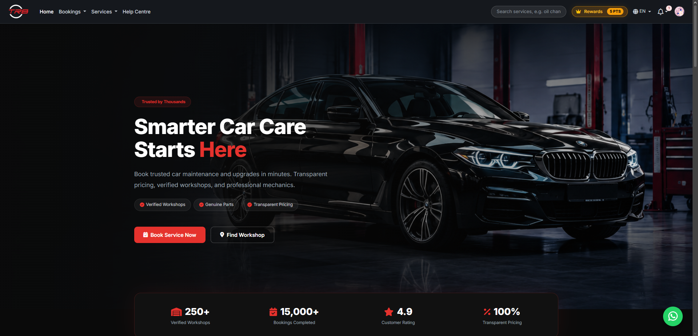
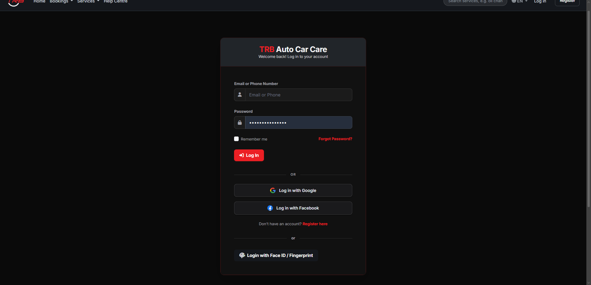
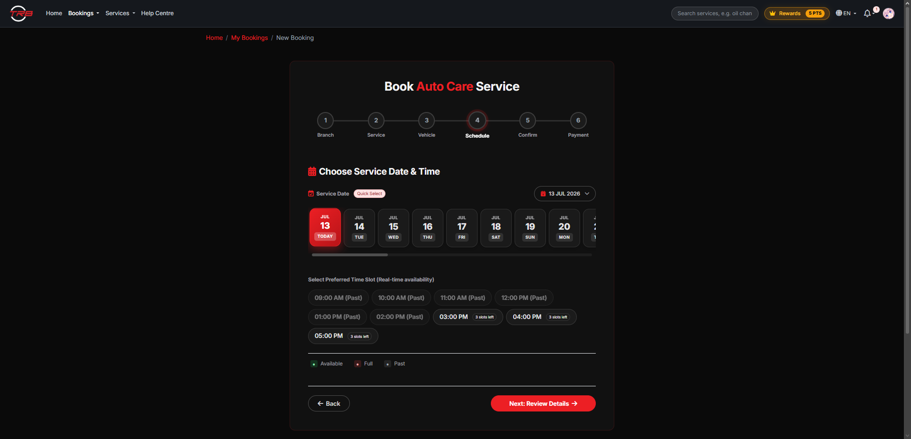
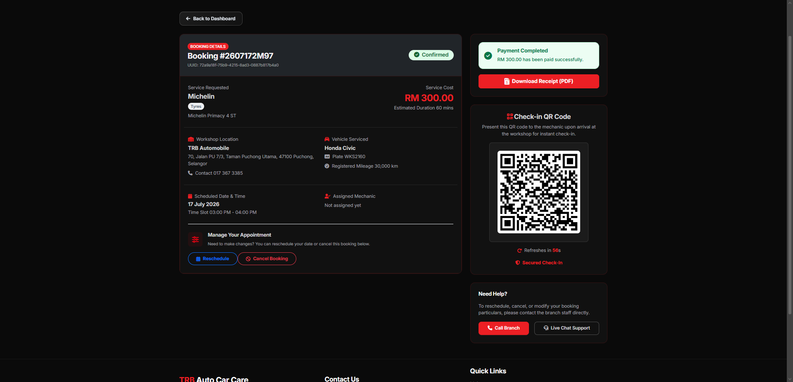
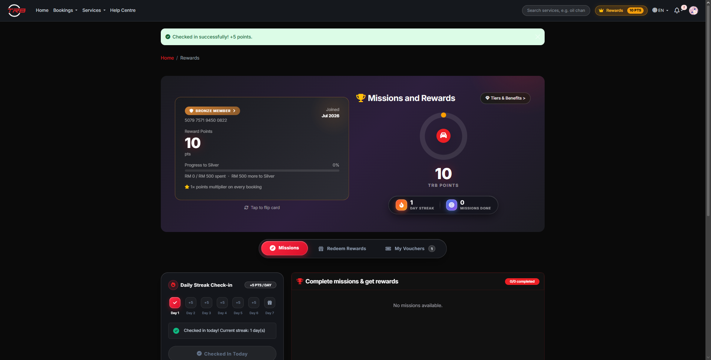
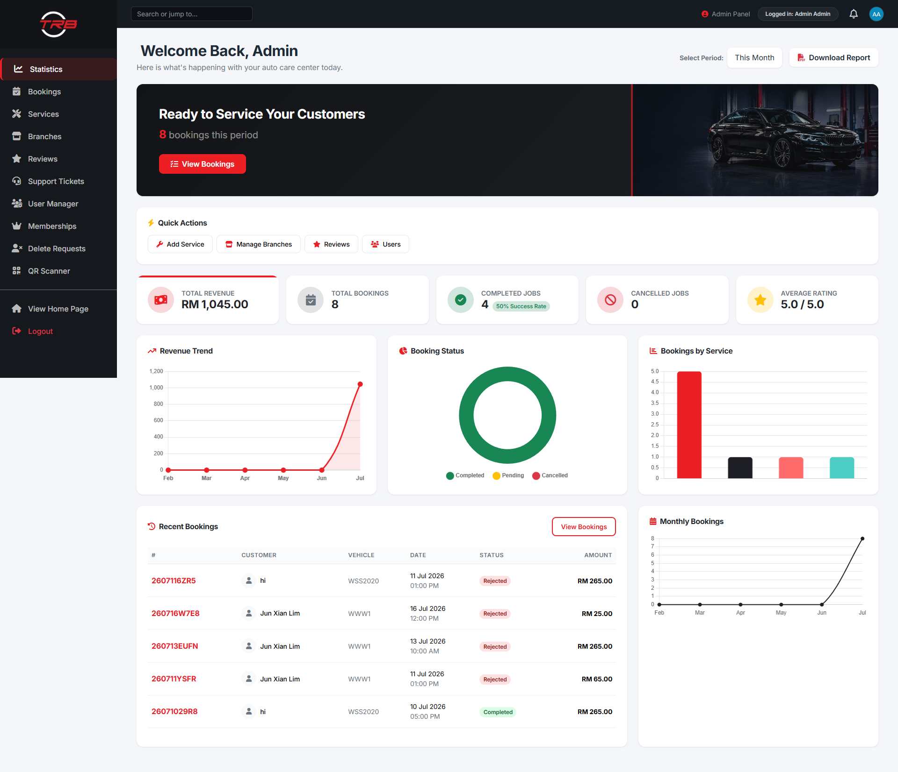

<div align="center">


# TRB Auto Car Care

**Online booking system for a car service workshop in Puchong, Selangor**


CAP2100 Final Year Project · INTI International College Subang · 2026



</div>

---

## 👥 Team

| Name | Role |
|------|------|
| **Wong Yew Chung** | Project lead · Frontend & poster design · QA testing · Report |
| **Chong Zhi Yong** | System implementation · Bug fixing · Use case diagrams · Requirements gathering |
| **Lim Jun Xian** | Database · System implementation · Backend logic · Gamification rewards |

**Supervisor:** Ms. Norayu Abdul Talib

## 📖 About

TRB Auto Car Care used to take bookings by phone calls, walk-ins and WhatsApp, which caused double bookings and left no service records.
This system lets customers **book, pay and check in online**, and gives the workshop one dashboard to manage everything.

## ✨ Features

<table>
<tr>
<td valign="top" width="33%">

### 👤 Customer
- 6-step booking wizard
- Real-time slot availability
- Pay online (Stripe) or at counter
- QR check-in pass + PDF receipt
- My Cars, Bookings, Favourites, Vouchers
- Support tickets with live chat
- In-app notifications

</td>
<td valign="top" width="33%">

### 🛠️ Admin & Mechanic
- Statistics dashboard + PDF reports
- Manage bookings, services, branches
- Manage users, reviews, tickets
- Membership & promo codes
- Main admin / sub-admin roles
- Mechanic job list & QR scanner

</td>
<td valign="top" width="33%">

### 🎁 Extras
- Membership tiers & reward points
- Daily check-in streak & missions
- Spin wheel rewards
- Google / Facebook login
- Passkey (Face ID / fingerprint)
- 🇬🇧 🇲🇾 🇨🇳 🇮🇳 4 languages
- Dark / light theme

</td>
</tr>
</table>

## 📸 Screenshots

| Login | Booking – pick a slot |
|:---:|:---:|
|  |  |
| **Booking with QR check-in** | **Rewards & membership** |
|  |  |

<p align="center"><b>Admin dashboard</b><br></p>

## 🧰 Tech Stack

| Layer | Tools |
|-------|-------|
| Backend | PHP 8.4, Laravel 13 (MVC) |
| Frontend | Blade, Tailwind CSS, Vite |
| Database | SQLite + Eloquent ORM |
| Auth | Laravel Socialite, WebAuthn |
| Payment | Stripe Checkout + webhook |
| PDF | DomPDF |

## 🚀 Getting Started

> **Requirements:** PHP 8.2+, Composer, Node.js 20+

```bash
git clone https://github.com/Laphii1206/Final-Year-project.git
cd Final-Year-project

composer install
npm install

cp .env.example .env
php artisan key:generate

php artisan migrate --seed
php artisan storage:link

composer run dev
```

Then open **http://localhost:8000** 🎉

> [!NOTE]
> Stripe and Google/Facebook login need your own keys in `.env`. Everything else works without them.

<details>
<summary><b>🔑 Demo accounts</b></summary>

| Role | Email | Password |
|------|-------|----------|
| Admin | admin@example.com | password |
| Mechanic | mechanic@example.com | password |
| Customer | customer@example.com | password |

> [!WARNING]
> For local testing only. Change these before deploying anywhere public.

</details>

<details>
<summary><b>⏰ Scheduled tasks (optional)</b></summary>

Appointment reminders, birthday notifications and auto-cancel of unpaid bookings run on the Laravel scheduler:

```bash
php artisan schedule:work
```

</details>

## 🔮 Future Work (Never) xd

- [ ] SMS / email reminders 24 hours before appointments
- [ ] Mobile app (Flutter)
- [ ] Cloud deployment with MySQL / PostgreSQL

---

<p align="center"><sub>Academic project — not an official production system of TRB Auto Car Care.</sub></p>
